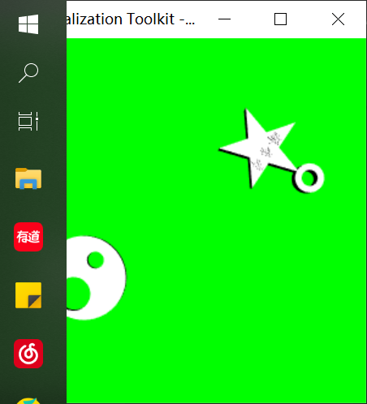
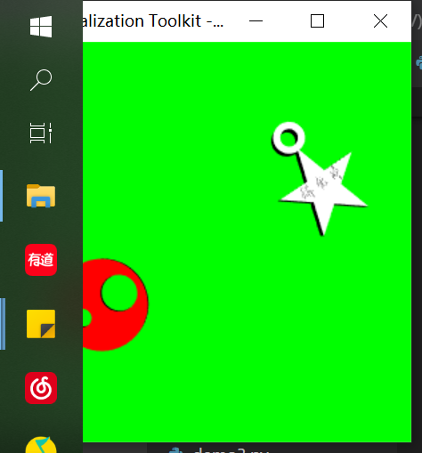

```python
import vtk
reader1 = vtk.vtkSTLReader()
reader1.SetFileName("clock.stl")
reader2 = vtk.vtkSTLReader()
reader2.SetFileName("shizhen.stl")
reader3 = vtk.vtkSTLReader()
reader3.SetFileName("fenzhen.stl")
reader4 = vtk.vtkSTLReader()
#reader4.SetFileName("second.stl")
mapper1= vtk.vtkPolyDataMapper()
mapper1.SetInputConnection(reader1.GetOutputPort())
mapper2= vtk.vtkPolyDataMapper()
mapper2.SetInputConnection(reader2.GetOutputPort())
mapper3= vtk.vtkPolyDataMapper()
mapper3.SetInputConnection(reader3.GetOutputPort())
#mapper4= vtk.vtkPolyDataMapper()
#mapper4.SetInputConnection(reader4.GetOutputPort()) 
actor1 = vtk.vtkActor()
actor1.SetMapper(mapper1)
actor2 = vtk.vtkActor()
actor2.SetMapper(mapper2)
renderer = vtk.vtkRenderer()
actor3 = vtk.vtkActor()
actor3.SetMapper(mapper3)
actor4 = vtk.vtkActor()
#actor4.SetMapper(mapper4)
renderWindow=vtk.vtkRenderWindow()
renderWindow.AddRenderer(renderer)
renderWindowInteractor=vtk.vtkRenderWindowInteractor() 
renderWindowInteractor.SetRenderWindow(renderWindow)
renderer.AddActor(actor1)
renderer.AddActor(actor2)
renderer.AddActor(actor3)
#renderer.AddActor(actor4)
renderer.SetBackground(0,255,255)
actor1.SetOrigin(actor1.GetCenter())
actor2.SetOrigin(actor1.GetCenter())
actor3.SetOrigin(actor1.GetCenter())
#actor4.SetOrigin(actor1.GetCenter())
actor1.GetProperty().SetColor(1,1,1)
actor2.GetProperty().SetColor(0,0,0)
actor3.GetProperty().SetColor(0,0,0)
#actor4.GetProperty().SetColor(1,0,0)
print ("actor1 center:",actor1.GetCenter())
while True:
    actor2.RotateZ(-0.001)
    actor3.RotateZ(-0.006)
    #actor4.RotateZ(-0.06)
    renderWindow.Render()

```

