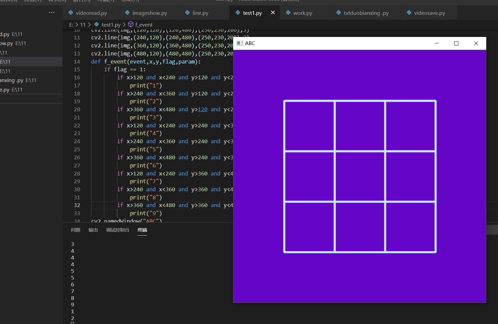

import numpy as np
import cv2
img=np.zeros((600,600,3),np.uint8)
img[:]=[200,5,100]
chess=np.zeros((3,3),np.int8)
cv2.line(img,(120,120),(480,120),(250,230,200),3)
cv2.line(img,(120,240),(480,240),(250,230,200),3)
cv2.line(img,(120,360),(480,360),(250,230,200),3)
cv2.line(img,(120,480),(480,480),(250,230,200),3)
cv2.line(img,(120,120),(120,480),(250,230,200),3)
cv2.line(img,(240,120),(240,480),(250,230,200),3)
cv2.line(img,(360,120),(360,480),(250,230,200),3)
cv2.line(img,(480,120),(480,480),(250,230,200),3)
cv2.namedWindow("ABC")
cv2.setMouseCallback("ABC",f_event)
while True:
    cv2.waitKey(10)
    cv2.imshow("ABC",img)
