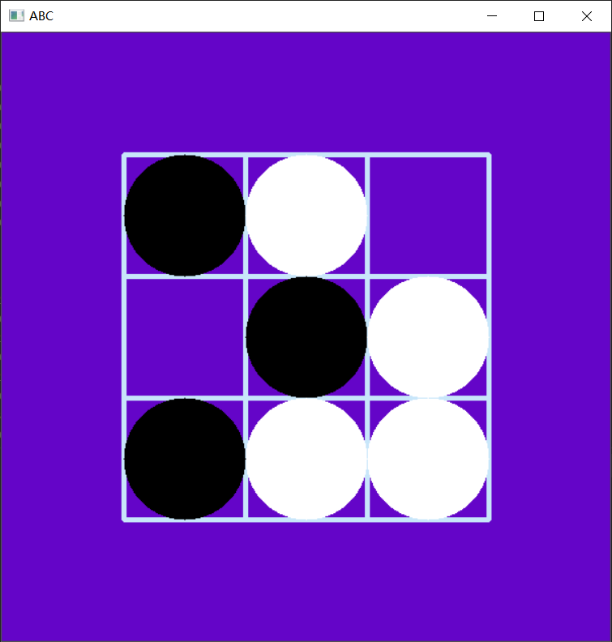

import numpy as np
import cv2
img=np.zeros((600,600,3),np.uint8)
img[:]=[200,5,100]
chess=np.zeros((3,3),np.int8)
cv2.line(img,(120,120),(480,120),(250,230,200),3)
cv2.line(img,(120,240),(480,240),(250,230,200),3)
cv2.line(img,(120,360),(480,360),(250,230,200),3)
cv2.line(img,(120,480),(480,480),(250,230,200),3)
cv2.line(img,(120,120),(120,480),(250,230,200),3)
cv2.line(img,(240,120),(240,480),(250,230,200),3)
cv2.line(img,(360,120),(360,480),(250,230,200),3)
cv2.line(img,(480,120),(480,480),(250,230,200),3)

def f_event(event,x,y,flag,param):
    if flag == 1:
        if x>120 and x<240 and y>120 and y<240:      
            cv2.circle(img,(180,180), 60, (0,0,0), -1)
        if x>240 and x<360 and y>120 and y<240:
            cv2.circle(img,(300,180), 60, (0,0,0), -1)
        if x>360 and x<480 and y>120 and y<240:
            cv2.circle(img,(420,180), 60, (0,0,0), -1)
        if x>120 and x<240 and y>240 and y<360:      
            cv2.circle(img,(180,300), 60, (0,0,0), -1)
        if x>240 and x<360 and y>240 and y<360:
            cv2.circle(img,(300,300), 60, (0,0,0), -1)
        if x>360 and x<480 and y>240 and y<360:
            cv2.circle(img,(420,300), 60, (0,0,0), -1)
        if x>120 and x<240 and y>360 and y<480:      
            cv2.circle(img,(180,420), 60, (0,0,0), -1)
        if x>240 and x<360 and y>360 and y<480:
            cv2.circle(img,(300,420), 60, (0,0,0), -1)
        if x>360 and x<480 and y>360 and y<480:
            cv2.circle(img,(420,420), 60, (0,0,0), -1)
    elif flag == 2:
        if x>120 and x<240 and y>120 and y<240:      
            cv2.circle(img,(180,180), 60, (255,255,255), -1)
        if x>240 and x<360 and y>120 and y<240:
            cv2.circle(img,(300,180), 60, (255,255,255), -1)
        if x>360 and x<480 and y>120 and y<240:
            cv2.circle(img,(420,180), 60, (255,255,255), -1)
        if x>120 and x<240 and y>240 and y<360:      
            cv2.circle(img,(180,300), 60, (255,255,255), -1)
        if x>240 and x<360 and y>240 and y<360:
            cv2.circle(img,(300,300), 60, (255,255,255), -1)
        if x>360 and x<480 and y>240 and y<360:
            cv2.circle(img,(420,300), 60, (255,255,255), -1)
        if x>120 and x<240 and y>360 and y<480:      
            cv2.circle(img,(180,420), 60, (255,255,255), -1)
        if x>240 and x<360 and y>360 and y<480:
            cv2.circle(img,(300,420), 60, (255,255,255), -1)
        if x>360 and x<480 and y>360 and y<480:
            cv2.circle(img,(420,420), 60, (255,255,255), -1)
cv2.namedWindow("ABC")
cv2.setMouseCallback("ABC",f_event)
while True:
    cv2.waitKey(10)
    cv2.imshow("ABC",img)
