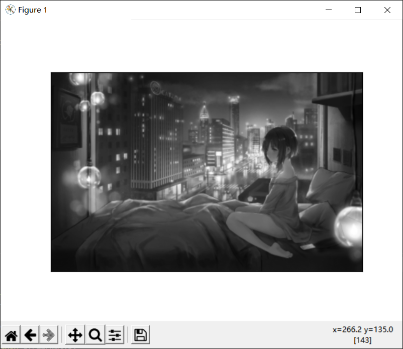

import numpy as np
import cv2
from matplotlib import pyplot as plt

img = cv2.imread("E:/11/girlone.jpg",0)
plt.imshow(img, cmap = 'gray', interpolation = 'bicubic')
plt.xticks([]),plt.yticks([])
plt.show()
